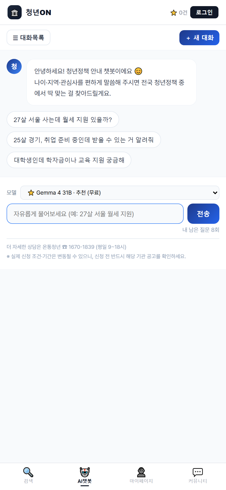
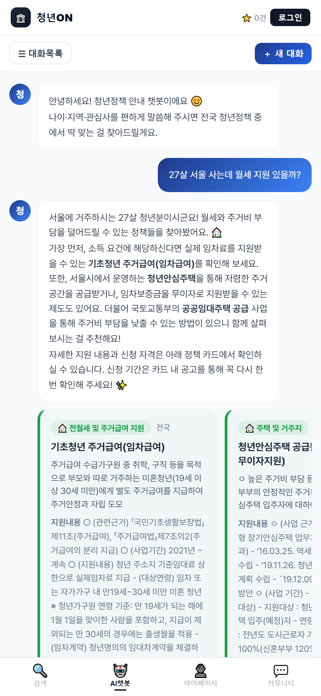
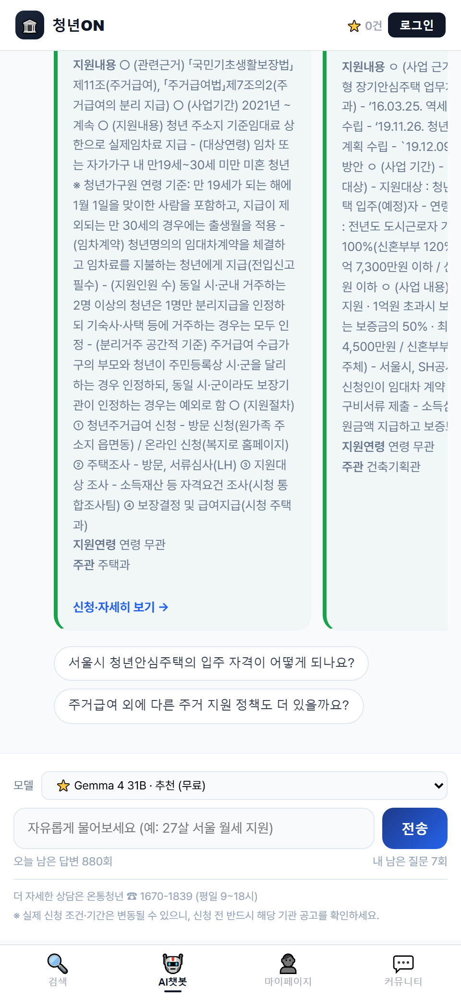
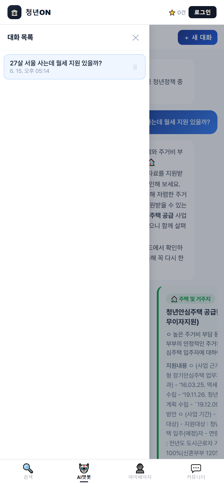

<style>
/* ===== 다크모드 ===== */
body { background:#0d1117 !important; color:#c9d1d9 !important; }
.page-header { background:#161b22 !important; background-image:linear-gradient(120deg,#0d2b4e,#0a3d2e) !important; border-bottom:1px solid #30363d; }
.main-content { color:#c9d1d9 !important; }
.main-content h1,.main-content h2,.main-content h3,.main-content h4,.main-content strong { color:#f0f6fc !important; }
.main-content a { color:#58a6ff !important; }
.main-content hr { background-color:#30363d !important; }
.main-content blockquote { color:#8b949e !important; border-left-color:#30363d !important; }
.main-content code { background:#161b22 !important; color:#79c0ff !important; border:1px solid #30363d; }
.main-content pre { background:#161b22 !important; border:1px solid #30363d; }
.main-content pre code { background:transparent !important; border:none; color:#c9d1d9 !important; }
.main-content table th,.main-content table td { border:1px solid #30363d !important; color:#c9d1d9 !important; }
.main-content table th { background:#161b22 !important; }
.main-content table tr { background:#0d1117 !important; border-top:1px solid #30363d; }
.main-content table tr:nth-child(2n) { background:#161b22 !important; }
.main-content img { border-radius:10px; border:1px solid #30363d; }

/* ===== 접기/펼치기 토글 ===== */
details { border:1px solid #30363d; border-radius:12px; background:#161b22; margin:18px 0; padding:0 18px; transition:border-color .2s ease; }
details:hover { border-color:#3d8bff55; }
details[open] { background:#10151c; }
summary { list-style:none; cursor:pointer; display:flex; align-items:center; gap:10px; padding:16px 0; user-select:none; }
summary::-webkit-details-marker { display:none; }
summary::before { content:"▶"; font-size:.75em; color:#58a6ff; transition:transform .25s ease; flex:0 0 auto; }
details[open] > summary::before { transform:rotate(90deg); }
details[open] > summary { border-bottom:1px solid #30363d; margin-bottom:10px; }
/* 펼칠 때 부드럽게 등장 */
details[open] > *:not(summary) { animation:revealDown .3s ease; }
@keyframes revealDown { from { opacity:0; transform:translateY(-8px); } to { opacity:1; transform:translateY(0); } }
</style>

# 🛠️ 청년ON 작업기록서

> **임종권** — AI 챗봇 · API · 관리자 페이지 담당
> 청년지원정책 안내 서비스(`youthsupportpolicy`)에서 **제가 직접 작업한 내역**만 모은 개인 기록입니다.
> 팀 메인 저장소와 분리된 공간이라, 머지·개편과 무관하게 작업 이력이 그대로 남습니다.

- 🔗 서비스(라이브): <https://yoon-kyoung.github.io/youthsupportpolicy/>
- 🔗 팀 저장소: <https://github.com/yoon-kyoung/youthsupportpolicy>
- 🔗 챗봇 백엔드(별도 레포): `team-ghpages-deploy` (Vercel 배포)

---

## 📌 작업 한눈에 보기

| 차수 | 브랜치 / 위치 | 한 일 | 상태 |
|------|--------|-------|------|
| **3차** | Apps Script · `api/chat.js` | 자동 QA(30분) + 대화분석(3시간) + 동적 시스템 프롬프트 — 셀프 개선 루프 | 운영 중 ✅ |
| **2차** | `feature/chatbot-ux` | 대화 저장·이어가기 · 연관질문 칩 · 정책카드 슬라이더 · 관리자 로그인·AI 사용량 | 검토 대기 |
| **1차** | `feature/chatbot-admin` | AI 챗봇 · 관리자 페이지 · 실시간 스트리밍 · 정책 자동선별 | main 병합 완료 ✅ |

---

<details open markdown="1">
<summary style="font-size:1.2em;font-weight:700;">🔄 3차 — 대화내역 고도화 파이프라인 · Apps Script + <code>api/chat.js</code> · 운영 중</summary>

> 2026.06.17 구축. 챗봇이 **스스로 대화를 분석하고 개선하는 자동 루프**. 사람 개입 없이 품질이 올라감.

### 전체 구조

```
┌─ 30분마다: runQA() ─────────────────────────────┐
│  OpenRouter 무료 모델로 테스트 질문 2개 동적 생성    │
│  → 챗봇 API에 x-qa-bot 헤더로 전송                │
│  → 구글시트 로그 탭에 🤖[자동QA]로 자동 기록        │
└─────────────────────────────────────────────────┘
         ↓ 로그 축적
┌─ 3시간마다: analyzeChatLogs() ──────────────────┐
│  최근 100건 대화(실제 사용자 + QA봇) 분석           │
│  → 자주 묻는 질문, 답변 품질, 개선점 도출           │
│  → settings 탭 chatInstructions 키에 저장          │
└─────────────────────────────────────────────────┘
         ↓ 개선 지시사항 반영
┌─ 매 요청: api/chat.js ─────────────────────────┐
│  getSettings()로 chatInstructions 읽기            │
│  → 시스템 프롬프트 끝에 "운영자 추가 지시" 동적 추가  │
│  → 개선된 답변 → 다음 QA에서 또 테스트              │
└─────────────────────────────────────────────────┘
```

### ① 자동 QA 봇 — `runQA()`

- **30분 간격** 시간 트리거로 자동 실행
- OpenRouter `openrouter/auto` (무료 모델)에게 질문 2개 생성 요청
- 생성 조건: 다양한 나이(19~34), 지역, 관심분야(취업/주거/교육/창업/복지) 랜덤 조합
- 엣지케이스 포함: 가끔 나이·지역을 빠뜨린 질문도 생성
- 출력 형식: JSON 배열 `["질문1", "질문2"]` — `indexOf('[')` + `JSON.parse()`로 파싱 (정규식 없음)
- 생성된 질문을 챗봇 API(`/api/chat`)에 `x-qa-bot: 1` 헤더와 함께 POST
- 백엔드가 이 헤더를 감지하면 질문 앞에 `🤖[자동QA]`를 붙여 구글시트에 기록
- 실제 사용자 로그와 QA 로그가 같은 시트에 쌓여, 분석 시 둘 다 활용됨

### ② 대화 로그 분석 — `analyzeChatLogs()`

- **3시간 간격** 시간 트리거로 자동 실행
- 로그 탭에서 최근 100건의 D열(질문) + E열(답변) 읽기
- OpenRouter에 분석 요청: 5가지 관점
  1. 사용자가 자주 묻는데 챗봇이 잘 못 대응하는 패턴
  2. 답변 톤·형식 개선점
  3. 사용자가 기대하지만 제공 못 하는 정보
  4. 반복되는 오해·혼란 패턴
  5. QA봇 질문 vs 실제 사용자 질문의 답변 품질 차이
- 분석 결과를 500자 이내 지시문으로 생성 → `settings` 탭 `chatInstructions`에 upsert
- `chatInstructionsUpdated`에 업데이트 시각도 함께 기록

### ③ 동적 시스템 프롬프트 — `api/chat.js`

- 매 챗봇 요청마다 `lib/settings.js`의 `getSettings()`를 호출
- 구글시트 settings 탭을 gviz CSV 엔드포인트로 읽어 `chatInstructions` 값 추출
- 기존 고정 시스템 프롬프트 뒤에 `--- 운영자 추가 지시 ---` 섹션으로 동적 삽입
- 변수명: `dynamicSystem` (커밋 `49fc2d8`)

### ④ 구글시트 settings 탭

- 시트 ID: `1vKSirUpGTuvFy40Hf5y9l_vOp5aNtRFuuC8jTfFpKfs`의 "settings" 탭
- 컬럼: `키 | 값 | 수정시각`
- 주요 키:
  - `chatInstructions` — AI가 생성한 챗봇 개선 지시사항 (최대 500자)
  - `chatInstructionsUpdated` — 마지막 분석 시각 (KST)

### 기술 포인트

- **완전 자동 루프**: QA 질문 생성 → 챗봇 테스트 → 로그 축적 → AI 분석 → 시스템 프롬프트 개선 → 더 나은 답변 → 다음 QA 사이클
- **비용 0원**: OpenRouter 무료 모델(`openrouter/auto`) + Google Apps Script 무료 트리거
- **QA/실사용자 구분**: `🤖[자동QA]` 태그로 로그에서 명확히 분리, 분석 시 실제 사용자 패턴 우선
- **정규식 미사용**: JSON 파싱에 `indexOf`/`lastIndexOf` + `JSON.parse`만 사용 (안정성 확보)
- **변경 파일**: `sheet-debug-logger.gs`(Apps Script, 버전 13), `api/chat.js`(동적 프롬프트), `lib/settings.js`(설정 읽기)
- **트리거 설치**: `setupAutoTriggers()` 수동 1회 실행으로 완료 (2026-06-17)

</details>

---

<details markdown="1">
<summary style="font-size:1.2em;font-weight:700;">🟢 2차 — 챗봇 UX 개선 <code>feature/chatbot-ux</code> · 검토 대기 (펼쳐보기)</summary>

> 2026.06.15 회의 배정. 챗봇을 "한 번 묻고 끝"이 아니라 **계속 쓰게** 만드는 작업.
> 아래 내용은 `feature/main-design-preview` 브랜치에 구현, 프리뷰 배포 완료.

### ① 대화 저장 + 이어서 채팅
- 새로고침해도 마지막 대화가 복원됩니다. AI도 이전 맥락(`apiHistory`)을 기억해 이어서 답합니다.
- `☰ 대화목록` 드로어에서 예전 대화를 꺼내보고, 삭제하고, 전체 비울 수 있습니다.
- 저장은 **localStorage**(브라우저 기준) — 아직 로그인 기능이 없어 식별정보가 없기 때문.
- 영속 계층을 `chatStore.js` 한 파일로 추상화 → **추후 서버(Supabase 등) 전환 시 이 파일 내부만 교체**하면 됨.

### ② 연관질문 말풍선(칩)
- 봇 답변 아래에 "이어서 물어볼 질문"이 버튼으로 뜨고, 누르면 바로 전송됩니다.
- 응답 텍스트의 `💬 이어서 물어보세요` 블록을 파싱(`parseFollowups`) → 헤더가 없으면 원문 그대로 폴백(안전).

### ③ 정책 카드 가로 슬라이더 + 색상 구분
- 세로로 쌓이던 카드를 **가로 스크롤(scroll-snap)** 로 변경 → 모바일에서 밀어보기 편함.
- 카테고리별 컬러바(주거·취업·교육 등)를 추가해 한눈에 구분.

### ④ 정책카드 가독성 개선
- 지원내용(`fmtSupport`) 줄바꿈 포맷팅: `·`, `- `, 번호 등 패턴 자동 줄바꿈.
- 3줄 넘으면 **"더보기"** 토글로 접기/펼치기.

### ⑤ 관리자 로그인 게이트
- 관리자 페이지 진입 시 데모 로그인(admin / 1234) 요구.
- 노란 안내 박스에 데모 계정임을 명시, 실제 서비스에서는 보안 인증 적용 예정 고지.

### ⑥ AI 사용량 모니터링 (관리자 06번 메뉴)
- 사이드바 06번 메뉴로 추가. Vercel `/api/usage` 엔드포인트 연동.
- KPI 카드 4개(오늘 요청·토큰·남은 답변·누적), 프로그레스바(사용률 색상 변화), 모델별 테이블.
- Google Sheets 전체 기록 바로가기 링크.

### 기술 포인트
- **스트리밍 레이스 가드**: 답변 받는 중 다른 대화로 전환해도 엉뚱한 세션에 글자가 안 섞이도록 요청 세션 ID 대조.
- **디바운스 자동저장**: 입력 멈춘 뒤 0.6초에 저장, 스트리밍 중엔 저장 안 함.
- **2단계 인증 구조**: 데모 로그인(admin/1234)으로 관리자 진입, API 사용량은 별도 ADMIN_PASSWORD 확인.
- **변경 파일**: `ChatBotView.jsx`, `PolicyCardMini.jsx`, `chatStore.js`(신규), `AdminShell.jsx`, `AiUsagePage.jsx`(신규), `MainContent.jsx`.

### 📸 화면

| 대화 시작 (상단 `☰ 대화목록`·`＋ 새 대화`) | AI 답변 + 정책 카드(가로 슬라이더·색상) |
|:---:|:---:|
|  |  |
| **연관질문 칩**(답변 아래 버튼) | **대화 목록** 드로어(저장·이어가기) |
|  |  |

</details>

---

<details markdown="1">
<summary style="font-size:1.2em;font-weight:700;">✅ 1차 — AI 챗봇 + 관리자 페이지 <code>feature/chatbot-admin</code> · main 병합 완료 (펼쳐보기)</summary>

> 2026.06.10 회의 결론 *"정책 비교 기능을 따로 만들기보다 챗봇이 비교·추천하게 하자"* 를 구현. main 병합되어 현재 라이브 운영 중.

### 한 일
- **AI 챗봇**: `"27살 서울인데 월세 지원 있어?"` 같은 자연어 질문 → AI가 상황 파악 후 전국 청년정책 2,600여 건 중 맞춤 추천.
- **실시간 스트리밍 답변**: ChatGPT처럼 글자가 하나씩 출력 → 대기 체감 감소.
- **AI 직접 정책 선별**: 응답 첫 줄 `[POLICY_IDS:]` 태그를 파싱해 정확한 정책 카드 매칭(최대 4개, 지역까지 정확히).
- **청년센터 폴백**: 추천할 정책이 없는 지역이면 지어내지 않고, 그 지역 청년센터(이름·전화)를 안내(전국 246곳 실데이터).
- **관리자 페이지**: 오늘 챗봇 사용 횟수·비용·모델별 통계 확인(비밀번호 보호).
- **백엔드 분리**: 챗봇 서버는 별도 레포 `team-ghpages-deploy`(Vercel). 프론트는 그 백엔드를 호출만 함.

### 기술 포인트
- 무료 LLM 사용(기본 모델 + 자동 폴백 교체)으로 운영비 0원 목표.
- 사용 기록을 Google Sheets에 자동 적재 → 관리자 페이지에서 집계.

</details>

---

<details markdown="1">
<summary style="font-size:1.2em;font-weight:700;">📎 챗봇 모듈 구성 (참고 · 펼쳐보기)</summary>

`src/chatbot/` 폴더 = 챗봇 기능 전체.

| 파일 | 역할 |
|------|------|
| `ChatBotView.jsx` | 챗봇 메인 UI (자유채팅 + 버튼 폴백 + 대화저장/이어가기 + 연관질문 칩) |
| `PolicyCardMini.jsx` | 정책 카드 (가로 슬라이더, 카테고리 색상 구분) |
| `AdminPage.jsx` | 관리자 페이지 (사용량·비용) |
| `chatStore.js` | 대화 영속 계층 (localStorage) — 추후 서버 전환 시 이 파일만 교체 |
| `recommend.js` · `policiesStore.js` · `codes.js` | 정책 추천·데이터·코드 매핑 |
| `config.js` | `API_BASE`(백엔드 주소), `QUESTION_LIMIT` |

**동작 흐름**
```
사용자 입력 → ChatBotView → POST {API_BASE}/api/chat (스트리밍)
  └ 백엔드(team-ghpages-deploy)가 LLM으로 응답 + X-Policy-Ids 헤더
ChatBotView: 스트리밍 표시 + 정책카드 + 연관질문 칩 + 대화 localStorage 저장
```

> ⚠️ 대화는 로그인 전이라 브라우저에 평문 저장됩니다. 공용 PC에서는 "전체 대화 삭제"로 정리하세요.

</details>

---

<sub>이 페이지는 임종권 개인 작업기록용이며 팀 메인 저장소와 독립적으로 관리됩니다.</sub>
